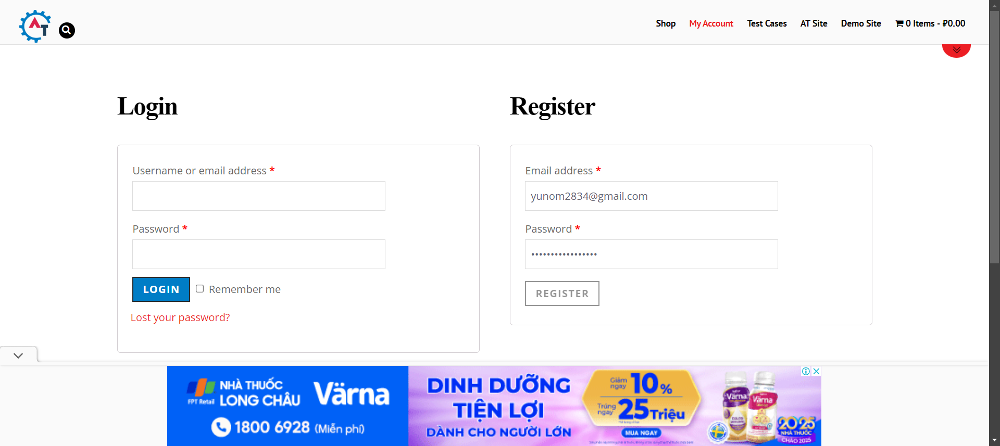
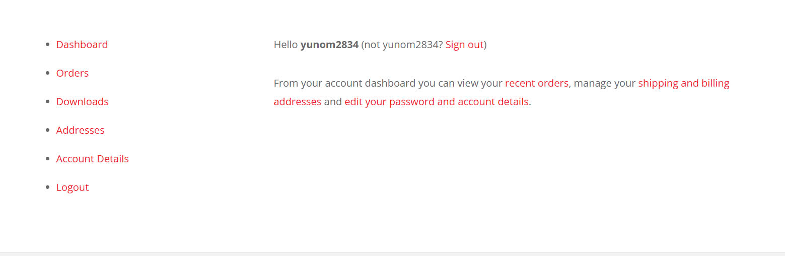
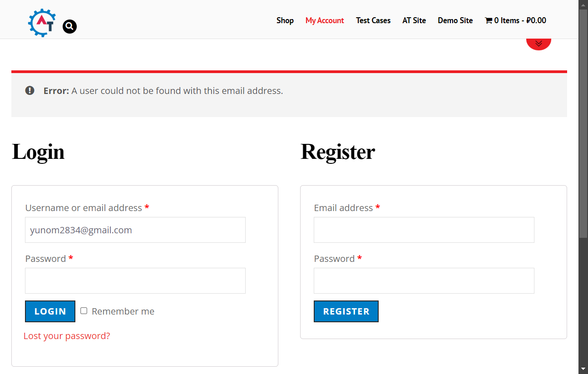

# AutomationTesting

## Mục Lục

1. [Giới Thiệu](#giới-thiệu)
2. [Yêu Cầu Hệ Thống](#yêu-cầu-hệ-thống)
3. [Cài Đặt](#cài-đặt)
4. [Cấu Trúc Dự Án](#cấu-trúc-dự-án)
5. [Chi Tiết Các Tệp Mã](#chi-tiết-các-tệp-mã)
  - [BaseTest.java](#basetestjava)
  - [RegisterTest.java](#registertestjava)
  - [LoginTest.java](#logintestjava)
  - [Main.java](#mainjava)
  - [pom.xml](#pomxml)
  - [testng.xml](#testngxml)
6. [Cách Sử Dụng](#cách-sử-dụng)
  - [Chạy Kiểm Thử](#chạy-kiểm-thử)
7. [Hình Ảnh Minh Họa](#hình-ảnh-minh-họa)
8. [Video Hướng Dẫn](#video-hướng-dẫn)
9. [Liên Hệ](#liên-hệ)

## Giới Thiệu

**AutomationTesting** là một dự án tự động hóa kiểm thử được xây dựng bằng **Selenium WebDriver** kết hợp với **TestNG**. Dự án nhằm mục đích kiểm thử chức năng đăng ký và đăng nhập trên trang web [Practice Automation Testing](https://practice.automationtesting.in/). **WebDriverManager** được sử dụng để quản lý các trình điều khiển (drivers) một cách tự động, giúp giảm thiểu thời gian cài đặt và cấu hình.

## Yêu Cầu Hệ Thống

- **Java**: Phiên bản 17
- **Maven**: Để quản lý các phụ thuộc và xây dựng dự án
- **IDE**: IntelliJ IDEA hoặc Eclipse
- **Trình duyệt Chrome**: Phiên bản mới nhất
- **Kết nối Internet**: Để WebDriverManager tải xuống các trình điều khiển cần thiết

## Cài Đặt

### 1. Cài Đặt Java

Đảm bảo rằng bạn đã cài đặt **JDK 17** trên máy tính của mình. Bạn có thể kiểm tra bằng lệnh:

```sh
java -version
```

### 2. Cài Đặt Maven

Tải và cài đặt **Maven** từ [trang chủ Maven](https://maven.apache.org/download.cgi). Sau khi cài đặt, kiểm tra bằng lệnh:

```sh
mvn -version
```

### 3. Clone Dự Án

Clone dự án từ GitHub:

```sh
git clone https://github.com/YunomiXavia/seleniumJavaTest.git
```

### 4. Mở Dự Án trong IDE

Mở dự án đã clone trong **IntelliJ IDEA** hoặc **Eclipse**.

### 5. Làm Mới (Refresh) Dự Án Maven

- **Trong IntelliJ IDEA:**
  - Mở cửa sổ **Maven** (thường nằm ở bên phải).
  - Nhấp vào nút **Reload All Maven Projects** (biểu tượng hai mũi tên quay vòng).

- **Trong Eclipse:**
  - Nhấp chuột phải vào dự án.
  - Chọn **Maven** > **Update Project...**.
  - Đánh dấu vào **Force Update of Snapshots/Releases** và nhấn **OK**.

## Cấu Trúc Dự Án

```
AutomationTesting/
├── pom.xml
├── src/
│   ├── main/
│   │   └── java/
│   │       └── com/automationtesting/
│   │           ├── BaseTest.java
│   │           └── Main.java
│   └── test/
│       └── java/
│           └── com/automationtesting/tests/
│               ├── LoginTest.java
│               └── RegisterTest.java
├── testng.xml
└── screenshots/
    ├── RegisterTest_failure.png
    ├── LoginTest_failure.png
    ├── LoginTest_success.png
    ├── logo.png
    └── demo.mp4
```

### Mô Tả Các Thành Phần Chính

- **BaseTest.java**: Lớp cơ bản chứa các phương thức thiết lập và hủy WebDriver. Tất cả các lớp kiểm thử sẽ kế thừa từ lớp này.

- **RegisterTest.java**: Lớp kiểm thử chức năng đăng ký người dùng trên trang web.

- **LoginTest.java**: Lớp kiểm thử chức năng đăng nhập người dùng trên trang web. Lớp này phụ thuộc vào kiểm thử đăng ký thành công từ `RegisterTest.java`.

- **Main.java**: Lớp chính để chạy các kiểm thử bằng cách sử dụng TestNG.

- **testng.xml**: Tệp cấu hình TestNG xác định các lớp kiểm thử sẽ được chạy.

- **pom.xml**: Tệp cấu hình Maven chứa các phụ thuộc và plugin cần thiết cho dự án.

- **screenshots/**: Thư mục chứa các ảnh chụp màn hình khi kiểm thử thất bại và các hình ảnh minh họa khác.

## Chi Tiết Các Tệp Mã

### BaseTest.java

Lớp `BaseTest` chịu trách nhiệm thiết lập và hủy WebDriver trước và sau mỗi bộ kiểm thử. Nó cũng chứa các biến chung như URL cơ bản, email và mật khẩu đã đăng ký.

```java
package com.automationtesting;

import io.github.bonigarcia.wdm.WebDriverManager;
import org.openqa.selenium.WebDriver;
import org.openqa.selenium.chrome.ChromeDriver;
import org.testng.annotations.*;
import org.slf4j.Logger;
import org.slf4j.LoggerFactory;

public class BaseTest {
    protected WebDriver driver;
    protected final String baseUrl = "https://practice.automationtesting.in/";
    protected static String registeredEmail;
    protected static String registeredPassword = "Dinhanst2832004%%";
    protected static String loginedEmail = "yunom2834@gmail.com";
    protected static String loginedPassword = "Dinhanst2832004%%";
    protected static final Logger logger = LoggerFactory.getLogger(BaseTest.class);

    @BeforeClass
    public void setUp() {
        logger.info("Thiết lập WebDriver");
        WebDriverManager.chromedriver().setup();
        driver = new ChromeDriver();
        driver.manage().window().maximize();
        logger.info("WebDriver đã được thiết lập và trình duyệt đã được mở");
    }

    @AfterClass
    public void tearDown() {
        logger.info("Đóng trình duyệt");
        if (driver != null) {
            driver.quit();
            logger.info("Trình duyệt đã được đóng");
        }
    }
}
```

### RegisterTest.java

Lớp `RegisterTest` thực hiện kiểm thử chức năng đăng ký người dùng mới trên trang web. Nó kiểm tra xem người dùng có thể đăng ký thành công và liên kết "Logout" có xuất hiện hay không.

```java
package com.automationtesting.tests;

import com.automationtesting.BaseTest;
import org.openqa.selenium.By;
import org.openqa.selenium.WebElement;
import org.openqa.selenium.OutputType;
import org.openqa.selenium.TakesScreenshot;
import org.openqa.selenium.support.ui.ExpectedConditions;
import org.openqa.selenium.support.ui.WebDriverWait;
import org.testng.Assert;
import org.testng.annotations.Test;
import org.slf4j.Logger;
import org.slf4j.LoggerFactory;

import java.io.File;
import java.io.IOException;
import java.time.Duration;
import org.apache.commons.io.FileUtils;

public class RegisterTest extends BaseTest {
    private static final Logger logger = LoggerFactory.getLogger(RegisterTest.class);

    @Test
    public void testRegistration() {
        logger.info("Bắt đầu kiểm thử đăng ký");
        driver.get(baseUrl + "my-account/");

        // Điền thông tin đăng ký
        registeredEmail = "yunom2834@gmail.com";
        logger.info("Email đăng ký: {}", registeredEmail);
        String password = registeredPassword;

        WebElement emailReg = driver.findElement(By.id("reg_email"));
        WebElement passwordReg = driver.findElement(By.id("reg_password"));
        WebElement registerButton = driver.findElement(By.name("register"));

        emailReg.sendKeys(registeredEmail);
        logger.info("Đã nhập email đăng ký");
        passwordReg.sendKeys(password);
        logger.info("Đã nhập mật khẩu đăng ký");
        registerButton.click();
        logger.info("Đã nhấn nút đăng ký");

        // Sử dụng WebDriverWait để đợi liên kết "Logout" xuất hiện
        WebDriverWait wait = new WebDriverWait(driver, Duration.ofSeconds(10));
        try {
            WebElement logoutLink = wait.until(ExpectedConditions.visibilityOfElementLocated(By.linkText("Logout")));
            Assert.assertTrue(logoutLink.isDisplayed(), "Đăng ký thành công, hiển thị liên kết Logout.");
            logger.info("Đăng ký thành công, liên kết Logout hiển thị");
        } catch (Exception e) {
            logger.error("Đăng ký không thành công", e);
            takeScreenshot("RegisterTest_failure.png");
            Assert.fail("Đăng ký không thành công.");
        }
    }

    // Phương thức chụp ảnh màn hình khi kiểm thử thất bại
    private void takeScreenshot(String fileName) {
        File srcFile = ((TakesScreenshot)driver).getScreenshotAs(OutputType.FILE);
        try {
            String screenshotPath = System.getProperty("user.dir") + "/screenshots/" + fileName;
            FileUtils.copyFile(srcFile, new File(screenshotPath));
            logger.info("Đã lưu ảnh chụp màn hình tại: {}", screenshotPath);
        } catch (IOException e) {
            logger.error("Lỗi khi lưu ảnh chụp màn hình", e);
        }
    }
}
```

### LoginTest.java

Lớp `LoginTest` thực hiện kiểm thử chức năng đăng nhập người dùng trên trang web. Nó phụ thuộc vào kết quả của `RegisterTest` để đảm bảo rằng người dùng đã đăng ký thành công trước khi đăng nhập.

```java
package com.automationtesting.tests;

import com.automationtesting.BaseTest;
import org.openqa.selenium.By;
import org.openqa.selenium.WebElement;
import org.openqa.selenium.OutputType;
import org.openqa.selenium.TakesScreenshot;
import org.openqa.selenium.support.ui.ExpectedConditions;
import org.openqa.selenium.support.ui.WebDriverWait;
import org.testng.Assert;
import org.testng.annotations.Test;
import org.slf4j.Logger;
import org.slf4j.LoggerFactory;

import java.io.File;
import java.io.IOException;
import java.time.Duration;
import org.apache.commons.io.FileUtils;

public class LoginTest extends BaseTest {
    private static final Logger logger = LoggerFactory.getLogger(LoginTest.class);

    @Test(dependsOnMethods = {"com.automationtesting.tests.RegisterTest.testRegistration"})
    public void testLogin() {
        logger.info("Bắt đầu kiểm thử đăng nhập");
        driver.get(baseUrl + "my-account/");

        WebElement emailLogin = driver.findElement(By.id("username"));
        WebElement passwordLogin = driver.findElement(By.id("password"));
        WebElement loginButton = driver.findElement(By.name("login"));

        emailLogin.sendKeys(loginedEmail);
        logger.info("Đã nhập email đăng nhập: {}", loginedEmail);
        passwordLogin.sendKeys(loginedPassword);
        logger.info("Đã nhập mật khẩu đăng nhập");
        loginButton.click();
        logger.info("Đã nhấn nút đăng nhập");

        WebDriverWait wait = new WebDriverWait(driver, Duration.ofSeconds(10));
        try {
            WebElement logoutLink = wait.until(ExpectedConditions.visibilityOfElementLocated(By.linkText("Logout")));
            Assert.assertTrue(logoutLink.isDisplayed(), "Đăng nhập thành công, hiển thị liên kết Logout.");
            logger.info("Đăng nhập thành công, liên kết Logout hiển thị");
        } catch (Exception e) {
            logger.error("Đăng nhập không thành công", e);
            takeScreenshot("LoginTest_failure.png");
            Assert.fail("Đăng nhập không thành công.");
        }
    }

    private void takeScreenshot(String fileName) {
        File srcFile = ((TakesScreenshot)driver).getScreenshotAs(OutputType.FILE);
        try {
            String screenshotPath = System.getProperty("user.dir") + "/screenshots/" + fileName;
            FileUtils.copyFile(srcFile, new File(screenshotPath));
            logger.info("Đã lưu ảnh chụp màn hình tại: {}", screenshotPath);
        } catch (IOException e) {
            logger.error("Lỗi khi lưu ảnh chụp màn hình", e);
        }
    }
}
```

### Main.java

Lớp `Main` là điểm khởi đầu để chạy các kiểm thử bằng cách sử dụng TestNG. Nó thiết lập danh sách các lớp kiểm thử và chạy chúng.

```java
package com.automationtesting;

import org.testng.TestNG;

import java.util.ArrayList;
import java.util.List;

public class Main {
    public static void main(String[] args) {
        TestNG testng = new TestNG();

        List<Class<?>> testClasses = new ArrayList<>();
        testClasses.add(com.automationtesting.tests.RegisterTest.class);
        testClasses.add(com.automationtesting.tests.LoginTest.class);

        testng.setTestClasses(testClasses.toArray(new Class[0]));

        testng.run();
    }
}
```

### pom.xml

Tệp `pom.xml` chứa các phụ thuộc và plugin cần thiết cho dự án Maven. Nó bao gồm Selenium, TestNG, WebDriverManager, SLF4J, và Apache Commons IO.

```xml
<project xmlns="http://maven.apache.org/POM/4.0.0"
         xmlns:xsi="http://www.w3.org/2001/XMLSchema-instance"
         xsi:schemaLocation="http://maven.apache.org/POM/4.0.0
         http://maven.apache.org/xsd/maven-4.0.0.xsd">
    <modelVersion>4.0.0</modelVersion>

    <groupId>com.automationtesting</groupId>
    <artifactId>AutomationTesting</artifactId>
    <version>1.0-SNAPSHOT</version>

    <properties>
        <maven.compiler.source>17</maven.compiler.source>
        <maven.compiler.target>17</maven.compiler.target>
        <project.build.sourceEncoding>UTF-8</project.build.sourceEncoding>
    </properties>

    <dependencies>
        <!-- Selenium Java -->
        <dependency>
            <groupId>org.seleniumhq.selenium</groupId>
            <artifactId>selenium-java</artifactId>
            <version>4.10.0</version>
        </dependency>

        <!-- TestNG -->
        <dependency>
            <groupId>org.testng</groupId>
            <artifactId>testng</artifactId>
            <version>7.8.0</version>
            <scope>test</scope>
        </dependency>

        <!-- WebDriver Manager để quản lý driver -->
        <dependency>
            <groupId>io.github.bonigarcia</groupId>
            <artifactId>webdrivermanager</artifactId>
            <version>5.3.2</version>
        </dependency>

        <!-- SLF4J cho logging -->
        <dependency>
            <groupId>org.slf4j</groupId>
            <artifactId>slf4j-simple</artifactId>
            <version>2.0.7</version>
        </dependency>

        <!-- Apache Commons IO -->
        <dependency>
            <groupId>commons-io</groupId>
            <artifactId>commons-io</artifactId>
            <version>2.11.0</version>
        </dependency>
    </dependencies>

    <build>
        <plugins>
            <!-- Compiler Plugin để thiết lập phiên bản Java -->
            <plugin>
                <groupId>org.apache.maven.plugins</groupId>
                <artifactId>maven-compiler-plugin</artifactId>
                <version>3.10.1</version>
                <configuration>
                    <source>17</source>
                    <target>17</target>
                </configuration>
            </plugin>

            <!-- Plugin để chạy TestNG từ Maven -->
            <plugin>
                <groupId>org.apache.maven.plugins</groupId>
                <artifactId>maven-surefire-plugin</artifactId>
                <version>3.0.0-M7</version>
                <configuration>
                    <suiteXmlFiles>
                        <suiteXmlFile>testng.xml</suiteXmlFile>
                    </suiteXmlFiles>
                </configuration>
            </plugin>
        </plugins>
    </build>
</project>
```

### testng.xml

Tệp `testng.xml` định nghĩa bộ kiểm thử của TestNG, xác định các lớp kiểm thử sẽ được chạy.

```xml
<!DOCTYPE suite SYSTEM "https://testng.org/testng-1.0.dtd" >
<suite name="AutomationTesting Suite" verbose="1" parallel="none">
    <test name="Register and Login Tests">
        <classes>
            <class name="com.automationtesting.tests.RegisterTest"/>
            <class name="com.automationtesting.tests.LoginTest"/>
        </classes>
    </test>
</suite>
```

## Cách Sử Dụng

### Chạy Kiểm Thử

Bạn có thể chạy các kiểm thử bằng hai cách chính:

#### 1. Sử Dụng Maven

Mở terminal và điều hướng đến thư mục gốc của dự án, sau đó chạy lệnh:

```sh
mvn clean test
```

Lệnh này sẽ dọn dẹp các tệp biên dịch cũ và chạy tất cả các kiểm thử được định nghĩa trong `testng.xml`.

#### 2. Sử Dụng `Main.java`

Mở lớp `Main.java` trong IDE và chạy lớp này như một ứng dụng Java thông thường. Điều này sẽ kích hoạt TestNG để chạy các kiểm thử đã được định nghĩa.

## Hình Ảnh Minh Họa

### 1. Kết Quả Đăng Ký Thất Bại



### 2. Kết Quả Đăng Nhập Thành Công



### 3. Kết Quả Đăng Nhập Thất Bại



## ChatGPT chấm điểm: 9.5/10
Link ChatGPT: https://chatgpt.com/share/6785d922-0a50-8004-a414-0b7cfc29c3e1

## Video Hướng Dẫn

Bạn có thể xem video hướng dẫn chạy kiểm thử và xem kết quả tại [đây](screenshots/demo.mkv).
